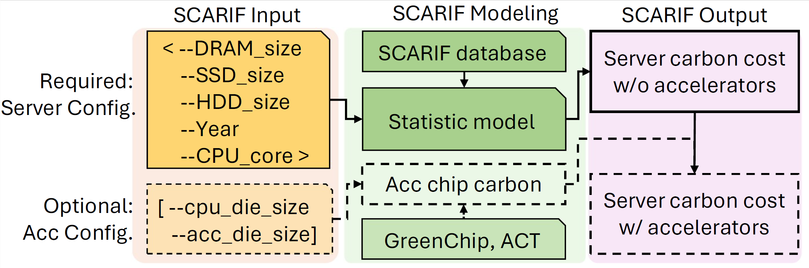

## Overview
This repo includes the data and codes for SCARIF, the Server Carbon including Accelerator Reporter with Intelligence-based Formulation tool. 
SCARIF is a tool to estimate the embodied carbon emissions of data center servers with accelerator hardware, including GPUs, FPGAs, etc.

- SCARIF collects the carbon footprint report from the main server vendors and performs feature extraction to train a statistic model. The original data and model are availiable.

- Based on some easy-to-get parameters, SCARIF can provide the carbon cost estimation of a whole server, taking not only the chips but also the peripheral parts into account.

- For accelerators like GPUs and FPGAs, which doesn't have a similar architecture like CPUs, SCARIF also provides a integration with the  tool. This helps to estimate the server-level carbon cost for servers equipped with accelerators.

- Compared with prior works, SCARIF can give a more accurate estimation for the server-level systems.

<!-- - By applying the SCARIF on servers of different years, the result suggests that it may takes a much longer period for new servers to 'catch up' with the old ones in terms of total carbon cost.  -->


## Quick Start
The SCARIF code aims to provide a easy, agile method for users to give first-order estimation to server-level computing systems. 
The code is built and verfied on Python `3.11.4` and no special packages are required.

To estimate a CPU-only system, the user may consider the following steps.

- Step0: install this repo. Please use `--recurse-submodules` to include the ACT as a submodule.

- Step1: prepare the inputs. Here the needed inputs include: The total core number of CPUs, the size of DRAM(GB), the size of SSD(GB), the size of HDD(GB), and the release date(in years).

- Step2: init the SCARIF predictor. The main part of the SCARIF predictor is in the `SCARIF_class.py`. Currently the configs are in stored in this file staticly, and we will expand the predictor in future upgrades.
```python
from SCARIF_class import HP_predictor #or Dell_predictor/Lenovo_predictor
predictor = HP_predictor()
```

- Step3: feed the input using the `setup()` function and get the carbon cost.
```python
predictor.setup(<cpu_core_num>, <dram_size>, <ssd_size>, <hdd_size>, <year>)
print(predictor.carbon)
```

## Code Structure
- the `original_data/` folder stores the data from carbon footprint reports of HP, Dell and Lenovo, respectively.
- the `SCARIF_class.py` includes the main part of the predictor.
- the `feature_extraction.ipynb` contains codes for reproducing the feature extration process of the SCARIF statistic model.
- the `Case0_figure1.py`,  `Case1_GPU_upgrade.py`, and `Case2_FPGA_number.py` includes some case studies using SCARIF.

## Examples
The `Case0_figure1.py`,  `Case1_GPU_upgrade.py`, and `Case2_FPGA_number.py` includes case studies of applying SCARIF, making estimations and make design choices in data center management.

### First-order estimation of servers
The `Case0_figure1.py` provides the estimation to 3 CPU-only server configs from Dell and HP: the 2017 Dell R740, the 2016 Dell C4130, and the 2017 HP DL380 base. Here the server configurations is the same as in the carbon footprint reports by the vendor, assuming the Intel Xeon 6152 is installed.

Running the `Case0_figure1.py` does not require any special packages.

### server upgrading tradeoffs
Usually the newer server will have a better energy efficiency, i.e., less operational carbon cost each year in the lifetime. However, upgrading the old servers to the new ones requires an instant carbon cost, which stands for the cost in the manufacturing of the new servers.

The  `Case1_GPU_upgrade.py` compares 2 generations of servers with acceleraters, the 2017 Dell R740 + V100 and the 2020 Dell R750 + A100. By analyzing the operational and embodied carbon costs, SCARIF can compute the break-even time, at which upgrading the servers and not upgrading have the same overall carbon cost.

SCARIF estimate a much larger embodied carbon cost for servers than prior works since SCARIF considers the peripheral part of the computing systems. As a result, a much longer break-even time is reported, which can be even larger than the typical lifetime of eletronic devices.

### server with FPGAs as accelerators
The `Case2_FPGA_number.py` shows how SCARIF estimate the carbon costs for server with FPGAs, and estimate the overall carbon costs in different years in the servers' life time.
 

