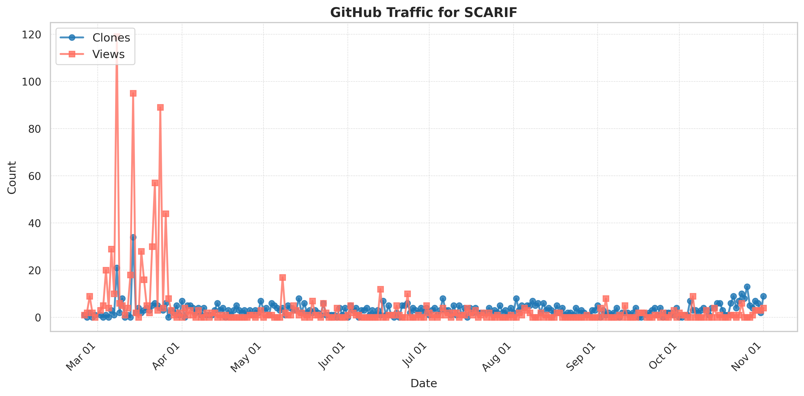

# Team
Principal Investigator: Prof. Peipei Zhou, https://peipeizhou-eecs.github.io/

Ph.D. Students: Shixin Ji (Student Lead), Zhuoping Yang, Xingzhen Chen

Faculty Collaborators: Professors Jingtong Hu (Pitt), Yiyu Shi (Notre Dame), Alex Jones (Syracuse)

Student Collaborators: Stephen Cahoon

## 🚀 Thank You for Using SCARIF!!
### Your support and growing engagement inspire us to continually improve and enhance SCARIF
- **Downloads since 22 Feb 2025:** <!--CLONES-->734<!--/CLONES-->
- **Views: since 22 Feb 2025:** <!--VIEWS-->864<!--/VIEWS-->



# SCARIF v0.2
## Overview
This repo includes the data and codes for SCARIF, the Server Carbon including Accelerator Reporter with Intelligence-based Formulation tool. 
SCARIF is a tool to estimate the embodied carbon emissions of data center servers with accelerator(Acc.) hardware, including GPUs, FPGAs, etc.

- SCARIF collects the carbon footprint report from the main server vendors and performs feature extraction to train a statistic model. The original data and model are availiable.

- Based on some easy-to-get parameters, SCARIF can provide the carbon cost estimation of a whole server, taking not only the chips but also the peripheral parts into account.

- For accelerators like GPUs and FPGAs, which doesn't have a similar architecture like CPUs, SCARIF also provides a integration with the [ACT](https://github.com/facebookresearch/ACT) tool. This helps to estimate the server-level carbon cost for servers equipped with accelerators.

- Compared with prior works, SCARIF can give a more accurate estimation for the server-level systems.


<!-- - By applying the SCARIF on servers of different years, the result suggests that it may takes a much longer period for new servers to 'catch up' with the old ones in terms of total carbon cost.  -->


## Quick Start
The SCARIF code aims to provide a easy, agile method for users to give first-order estimation to server-level computing systems. 
The code is built and verfied on Python `3.11.4` and no special packages are required.

### installation
Please use `--recurse-submodules` to include the ACT as a submodule.
```shell
git clone https://github.com/arc-research-lab/SCARIF.git --recurse-submodules
```

### SCARIF command line tool

To estimate the carbon cost of a server, the user may consider the following steps.

- Step1: prepare the required server configs. Here the needed configs include: The total core number of CPUs, the size of DRAM(GB), the size of SSD(GB), the size of HDD(GB), and the release date(in years).
- (Step1.5): Optionally, to estimate the carbon cost of a server with its accelerators, the optional accelerator configs are needed: the technology node/fabrication process of the accelerator(nm), and the chip area of the accelerator
- Step2: use Python to luanch the command line tool, use `-c, -d, -s, -hd, -y` for the required server configs, and the `-at, -aa` for the optional accelerator configs. 
- (Step2.5): Optionally, users can use change the configs of the predictor it self. Currently users can change the vendors using `--vendor`. We will implement other methods in the future release.
Here are two examples are as follows:
```shell
python SCARIF.py -c 56 -d 64 -s 0 -hd 1000 -y 2017 --vendor Dell
#profile of Dell R740 with 2x 28-core Xeon 8180 CPU, 64GB DRAM, no SSD, 1TB HDD, and released in 2017

python SCARIF.py -c 64 -d 64 -s 0 -hd 1000 -y 2020 -at 10 -aa 826 --vendor Dell
#profile of Dell R750 with 2x 32-core Xeon 8375 CPU, 64GB DRAM, no SSD, 1TB HDD, and released in 2020,
#together with 1 A100 with 10nm fab process and 826 mm^2 chip area
```
### SCARIF command line tool examples
- case1: Dell R740 CPU server
    - 
```shell
python SCARIF.py -cpu_core_num 44 --dram 32 --ssd 0 --hdd 4800 --year 2017 --vendor Dell
```

- case2: Dell R740 CPU server with self defined server configs
    - 
```shell
python SCARIF.py -c 56 --d 32 --s 2400 --hd 4800 --year 2017 --vendor Dell
```

- case 3: server with GPUs
    - 
```shell
python SCARIF.py -c 56 --d 32 --s 2400 --hd 4800 --year 2017 --vendor Dell -at 14 -aa 1630
```

- case 4: server with FPGA
    - 
```shell
python SCARIF.py -c 56 --d 256 --s 1800 --hd 0 --year 2019 --vendor HP -at 14 -aa 844
```

### SCARIF class
Alternatively, users may use the SCARIF class to integrate SCARIF into their scripts

- Step1: prepare the inputs. same as above

- Step2: init the SCARIF predictor. The main part of the SCARIF predictor is in the `SCARIF_class.py`. Currently the configs are in stored in this file staticly, and we will expand the predictor in future upgrades.
```python
from SCARIF_class import HP_predictor #or Dell_predictor/Lenovo_predictor
predictor = HP_predictor()
```

- Step3: feed the input using the `setup()` function and get the carbon cost.
```python
#the acc_tech_node and the acc_chip_area are optional
predictor.setup(<cpu_core_num>, <dram_size>, <ssd_size>, <hdd_size>, <year>, acc_tech_node=<acc_tech_node>,acc_chip_area=<acc_chip_area>)
#generate report automatically
print(predictor)
```

## Code Structure
- the `original_data/` folder stores the data from carbon footprint reports of HP, Dell and Lenovo, respectively.
- the `SCARIF_class.py` includes the main part of the predictor.
- the `feature_extraction.ipynb` contains codes for reproducing the feature extration process of the SCARIF statistic model.
- the `Case0_figure1.py`,  `Case1_GPU_upgrade.py`, and `Case2_FPGA_number.py` includes some case studies using SCARIF.

## Examples
The `Case0_figure1.py`,  `Case1_GPU_upgrade.py`, and `Case2_FPGA_number.py` includes case studies of applying SCARIF, making estimations and make design choices in data center management.

### First-order estimation of servers
The `Case0_figure1.py` provides the estimation to 3 CPU-only server configs from Dell and HP: the 2017 Dell R740, the 2016 Dell C4130, and the 2017 HP DL380 base. Here the server configurations is the same as in the carbon footprint reports by the vendor, assuming the Intel Xeon 6152 is installed.

Running the `Case0_figure1.py` does not require any special packages.

### server upgrading tradeoffs
Usually the newer server will have a better energy efficiency, i.e., less operational carbon cost each year in the lifetime. However, upgrading the old servers to the new ones requires an instant carbon cost, which stands for the cost in the manufacturing of the new servers.

The  `Case1_GPU_upgrade.py` compares 2 generations of servers with acceleraters, the 2017 Dell R740 + V100 and the 2020 Dell R750 + A100. By analyzing the operational and embodied carbon costs, SCARIF can compute the break-even time, at which upgrading the servers and not upgrading have the same overall carbon cost.

SCARIF estimate a much larger embodied carbon cost for servers than prior works since SCARIF considers the peripheral part of the computing systems. As a result, a much longer break-even time is reported, which can be even larger than the typical lifetime of eletronic devices.

### server with FPGAs as accelerators
The `Case2_FPGA_number.py` shows how SCARIF estimate the carbon costs for server with FPGAs, and estimate the overall carbon costs in different years in the servers' life time.

## Media
- ISVLSI SCARIF demo video: [youtube video](https://www.youtube.com/watch?v=TZmR5TYUP6k)
- ISVLSI SCARIF slides: [SCARIF slides](media/ISVLSI24_SCARIF_Final_Slides.pdf)

## Reference
Please cite SCARIF if it helps your research.
```
@inproceedings {isvlsi24scarif,
  author={Ji, Shixin and Yang, Zhuoping and Cahoon, Stephen and Jones, Alex K and Zhou, Peipei},
  booktitle={2024 IEEE Computer Society Annual Symposium on VLSI (ISVLSI)}, 
  title={SCARIF: Towards Carbon Modeling of Cloud Servers with Accelerators}, 
  year={2024},
  volume={},
  number={},
  pages={1-6},
  doi={}}
```
## Release Notes
- 2024/07/15
    - update the README
        - added a section of examples
        - added a section of reference
        - added a section of medias
- 2024/05/05 SCARIF v0.2
    - update the core class of SCARIF tool
        - the estimation of Acc.'s carbon cost now relies on a fixed baseline, instead of the host servers' CPUs. 
            - This will futher simplify the work needed for estimation: now the users may only give the Acc.'s chip area as Optional Acc. Configs to estimate servers w/ Accelerators.
            - Currently the baseline is set as the Intel Xeon 8180 CPU by default, and several additional choices will be added to this tool. We'll also design a more comprehensive baseline for accelerator carbon estimation once the corresponding database of SCARIF is expanded.
            - This update may cause come result shifting in carbon cost estimation, but won't affact SCARIF's functionality as a first-order estimation tool.
        - the accelerators' carbon cost estimation flow is integrated into the core class of SCARIF tool
            - now users can feed the Optional Acc. Configs directly into the main class
    - release the SCARIF command line tool
        - We release the SCARIF command line tool, `SCARIF.py`, to enhance the user experience
        - simply use `python SCARIF.py --help` for useful information
    - Updates on examples
        - We update the examples to make them better suited for the new SCARIF workflow. The old examples, which are still useful for result reproducing of the paper, are moved into the `result_reproducing\` folder
        - The new examples, also naming after the "CaseX_..." convention, are using the same setup as the old ones.
    - Updates on README
- 2024/04/29 SCARIF v0.1
    - release the original data
    - release the core class of SCARIF tool
    - release the codes used for data extraction 
    - release the codes used for analysis towards CPU-only server setup, CPU+GPU server setup, and CPU+FPGA server setup
